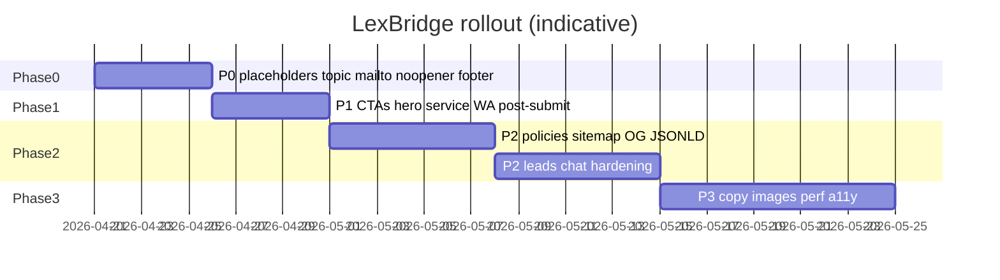

# LexBridge — implementation plan

This plan extends **[PROJECT-AUDIT.md](./PROJECT-AUDIT.md)** with sequenced work, dependencies, and acceptance criteria. Use phases to batch PRs; within a phase, tasks marked **(parallel)** can run concurrently.

---

## How to read this document

| Column / concept | Meaning |
|------------------|---------|
| **Phase** | Recommended merge order; lower phases unblock marketing and trust. |
| **Epic** | A theme (e.g. Contact deep links). |
| **Task** | Concrete deliverable, often one PR. |
| **AC** | Acceptance criteria — ship when all bullets pass. |

---

## Phase 0 — Foundation (trust + correctness)

*Goal: Nothing misleading; contact paths work; placeholders documented.*

| ID | Epic | Task | Dependencies | Acceptance criteria (AC) |
|----|------|------|----------------|---------------------------|
| P0-1 | Contact data | Replace `whatsappE164`, `emailInfo`, `emailCare` in `src/content/site.ts` with production values; add internal runbook (where numbers are verified). | None | WhatsApp links open correct Business number; mailto targets real inboxes. |
| P0-2 | Contact `?topic=` | **Server:** `contact/page.tsx` reads `searchParams.topic` (Next.js `searchParams` prop). **Client:** `ContactForm` accepts optional `defaultTopic` / hidden or visible “Reason for contact” prefilled from slug; include topic in mailto `subject` or `body`. | None | From mega menu `/contact?topic=finance-lawyers`, form shows topic and email draft includes it. |
| P0-3 | Package identity | Rename `package.json` `name` to `lexbridge` (or chosen npm scope). | None | `npm run build` still passes; no broken scripts. |
| P0-4 | Footer UX | Add “Care:” (or equivalent) label before `emailCare` in `Footer.tsx`. | None | Two email lines are equally scannable. |
| P0-5 | External links | `ButtonLink` external: `rel="noopener noreferrer"` (and verify other `target="_blank"` anchors). | None | Matches security baseline. |

**Phase 0 exit:** Contact deep links work; placeholders gone or explicitly “staging only”; small a11y/security fixes merged.

---

## Phase 1 — CTAs (calls to action)

*Goal: Every CTA label matches behavior; context travels to WhatsApp/contact where useful.*

| ID | Epic | Task | Dependencies | AC |
|----|------|------|----------------|-----|
| P1-1 | Header CTAs | **Option A (recommended):** Map “Chat with lawyer” → WhatsApp prefill (`whatsappPrefillChat`); “Talk to lawyer” → `/contact` or `tel:` primary. **Option B:** Rename both buttons to match current `/contact` behavior (“Request callback” / “Contact us”). Pick one strategy and apply to desktop + mobile header. | P0-1 (real WA number) | Labels and destinations documented in code comment or README; no duplicate misleading pair. |
| P1-2 | Hero alignment | Align hero primary/secondary buttons with same strategy as P1-1 (WhatsApp vs web intake). | P1-1 | Hero and header use consistent channel mapping. |
| P1-3 | Service page CTAs | Add secondary CTA: WhatsApp link with prefill including `serviceTitle` (and optional slug) on `ServiceLeadForm` sidebar or below submit. Reuse `whatsappUrl` helper. | P0-1, P1-1 strategy | From a service page, one tap opens WA with readable context line. |
| P1-4 | Mega menu → contact | After P0-2, verify all `?topic=` values appear in contact UI or body; add human-readable map `topic` slug → short label if needed (`content/contactTopics.ts`). | P0-2 | Spot-check 5 random menu links. |
| P1-5 | Legal updates UX | **Option A:** Change copy to “On this page” / remove full-row `<Link>` if not navigable. **Option B:** Add `/updates/[slug]` routes + MDX/CMS later (Phase 3). For Phase 1, prefer A unless editorial pipeline exists. | None | Users are not sent to a fake “article”; OR real articles exist. |
| P1-6 | Post-submit mailto | On `ContactForm` / `ServiceLeadForm` after “sent”, show secondary actions: “Prefer WhatsApp?” + link; “Copy message” optional. | P0-1 | User has fallback if mail client does not open. |

**Phase 1 exit:** CTAs are honest, consistent, and service/menus pass context to contact or WhatsApp.

---

## Phase 2 — Missing features and gaps (product + SEO)

*Goal: Crawlability, compliance pages, structured data, optional real leads.*

| ID | Epic | Task | Dependencies | AC |
|----|------|------|----------------|-----|
| P2-1 | Policies | Add routes: `/privacy`, `/terms` (and `/cookies` if analytics added). Link from footer + short mention near forms/chat. | None | Pages exist; footer links work; content reviewed by stakeholder (not AI-only for legal text). |
| P2-2 | SEO files | Add `src/app/sitemap.ts` and `src/app/robots.ts` (Next.js Metadata API). Include `/`, `/about`, `/contact`, all `/service/[slug]`, policy URLs. | P2-1 URLs known | `/sitemap.xml` and `/robots.txt` valid; submit to Search Console when domain live. |
| P2-3 | OG + canonical | In `layout.tsx` (and overrides per page): `metadataBase`, `openGraph.images` (default 1200×630 asset in `/public`), `twitter.card`, canonical alternates if needed. | Asset in `public/` | Sharing homepage shows title + image. |
| P2-4 | JSON-LD | Add `<script type="application/ld+json">` for `Organization` (+ `LocalBusiness` or `PostalAddress` for offices if appropriate). Single component used in layout or home. | P2-3 `metadataBase` | Rich Results Test shows no critical errors. |
| P2-5 | Legal updates (content) | If editorial capacity: model `legalUpdates` with `slug`, add `app/updates/[slug]/page.tsx`, migrate `#updates` links. If not: keep Phase 1 “on this page” UX and close epic. | P2-2 for new URLs | No dead expectations. |
| P2-6 | Lead pipeline | Replace or supplement mailto: `POST /api/contact` → Resend/SendGrid/Formspree + server validation + honeypot; store optional webhook to CRM. | P2-1 privacy text | Submissions logged or emailed server-side; spam rate monitored. |
| P2-7 | Chat production | `.env.example` documenting `OLLAMA_MODEL`, `OLLAMA_BASE_URL`; rate limit `/api/chat` (e.g. IP + sliding window); optional switch to hosted LLM. | P2-1 | Abuse surface reduced; deploy docs complete. |
| P2-8 | i18n (optional) | If required: next-intl or route segments `[locale]` — **defer** until P0–P2 core shipped. | Product decision | N/A until approved. |
| P2-9 | Booking / payments | Product design only until scope approved; document flows in wiki — **defer** per audit. | Business | N/A until approved. |

**Phase 2 exit:** Search + share + legal baseline; leads and chat production-ready if you implement P2-6 / P2-7.

---

## Phase 3 — Copy, images, performance, accessibility

*Goal: Polish and speed; aligns with audit sections beyond gaps/CTAs.*

| ID | Epic | Task | Dependencies | AC |
|----|------|------|----------------|-----|
| P3-1 | Copy pass | Apply `site.ts` fixes: Lawyer specializations, TM/GST wording, Startup casing, “Obtain encumbrance certificate”; hero headline + “Free” only if true; contact `metadata.description` aligned with prod vs demo; testimonial disclaimer if quotes are illustrative. | None | Copy checklist in audit cleared. |
| P3-2 | Imagery | Replace or curate Unsplash; align “Adv.” naming; consider `object-cover` on tiles with fixed focal points; add `public/og-default.png`. | P2-3 | Visual consistency on home + service hero. |
| P3-3 | Header performance | Split mega menu into subcomponents; lazy mount mobile drawer subtree; measure bundle (next build analyze). | None | Meaningful reduction or documented tradeoff. |
| P3-4 | A11y | Desktop: true `aria-expanded` / `aria-controls` for hover menus (open on focus + hover state); verify focus rings; Property suggested links — distinct visible labels if testing shows confusion. | None | Spot-check with keyboard + VoiceOver/NVDA. |
| P3-5 | Analytics | Privacy-first analytics (e.g. Plausible) + cookie banner if EU traffic — tie to P2-1 cookies page. | P2-1 | Events for CTA clicks optional. |
| P3-6 | Contrast QA | Audit `text-muted` on `bg-surface` / cards; adjust tokens in `globals.css` if failures. | None | WCAG AA for body UI text where feasible. |

---

## Dependency overview (text)

```
P0-1 (real contacts) ──┬──► P1-1, P1-2, P1-3, P1-6
P0-2 (topic on contact) ──► P1-4
P1-1 (CTA strategy) ──► P1-2, P1-3
P2-1 (policies) ──► P2-5, P2-6, P3-5
P2-3 (OG asset) ──► P3-2 (can share same asset)
```

---

## Mermaid — suggested swimlane by week (indicative)



Adjust durations to team size; **P0-2 + P1-1** are the highest leverage for user trust.

---

## PR slicing suggestion

| PR | Includes |
|----|----------|
| PR1 | P0-2, P0-4, P0-5 (contact topic + small UI + security) |
| PR2 | P0-1, P0-3 (secrets / rename — separate if CI uses package name) |
| PR3 | P1-1, P1-2, P1-3, P1-6 (CTA consistency + service WA + fallbacks) |
| PR4 | P1-5 (legal updates UX) |
| PR5 | P2-1, P2-2, P2-3, P2-4 (legal + SEO bundle) |
| PR6 | P2-6 and/or P2-7 (backend — isolated for secrets review) |
| PR7 | P3-1 … P3-6 (polish waves) |

---

## Definition of done (global)

- [ ] `npm run build` and `npm run lint` pass.
- [ ] No regression on mobile header + mega menus.
- [ ] Contact and WhatsApp flows manually tested on Windows + one mobile device.
- [ ] Stakeholder sign-off on legal copy for policies and hero claims.

---

## Traceability to audit

| Audit section | Phases |
|---------------|--------|
| Missing features and gaps | P0-2, P2-1 … P2-9, P3-4 |
| CTAs | P1-1 … P1-6 |
| Copy and content | P0-3, P0-4, P3-1 |
| Images and media | P2-3, P3-2 |
| Performance and technical | P0-5, P2-7, P3-3, P3-5 |
| Accessibility | P3-4, P3-6 |

Update this plan when scope changes; keep **PROJECT-AUDIT.md** as the source of *what* is wrong and this file as the source of *how* you fix it in order.
